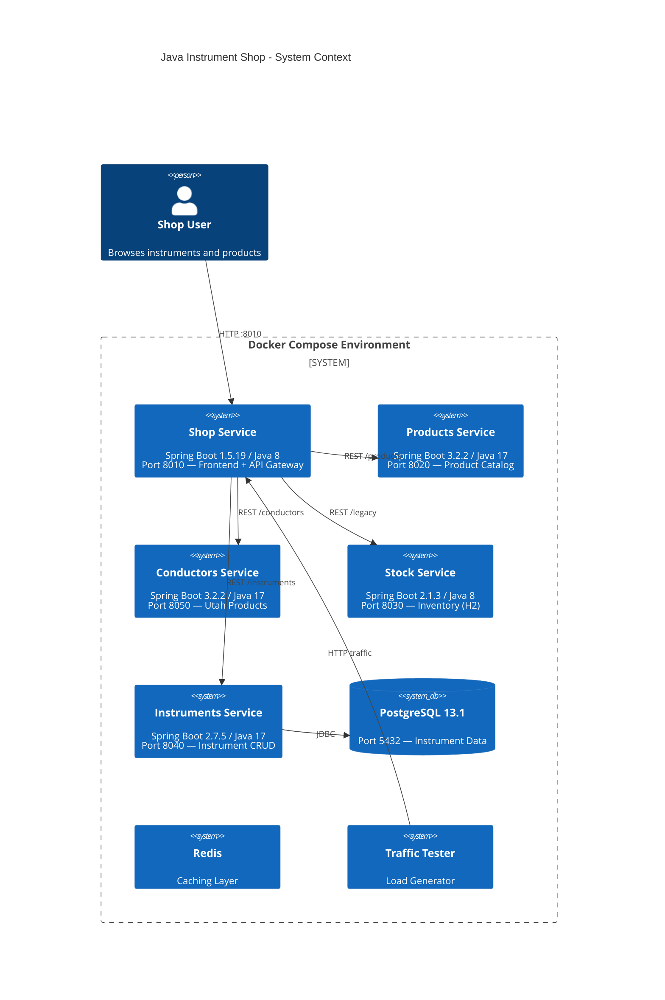

# System Context Diagram

## Deployment Architecture



## ASCII System Context

```
                    ┌──────────────┐
                    │  👤 User     │
                    │  Browser     │
                    └──────┬───────┘
                           │ HTTP :8010
                           ▼
┌─────────────────────────────────────────────────────────┐
│              Docker Compose Environment                   │
│                                                          │
│  ┌──────────────────────────────────────────────┐       │
│  │           Shop Service (API Gateway)          │       │
│  │        Spring Boot 1.5.19 | Java 8            │       │
│  │     Hystrix Circuit Breaker | Thymeleaf       │       │
│  └───┬──────────┬────────────┬──────────┬───────┘       │
│      │          │            │          │               │
│      ▼          ▼            ▼          ▼               │
│  ┌────────┐ ┌────────┐ ┌────────┐ ┌──────────┐        │
│  │Products│ │Conduct-│ │ Stock  │ │Instrumen-│        │
│  │Service │ │ors Svc │ │Service │ │ts Service│        │
│  │SB 3.2.2│ │SB 3.2.2│ │SB 2.1.3│ │SB 2.7.5 │        │
│  │Java 17 │ │Java 17 │ │Java 8  │ │Java 17   │        │
│  │In-mem  │ │In-mem  │ │H2 DB   │ │JPA/JDBC  │        │
│  └────────┘ └────────┘ └────────┘ └────┬─────┘        │
│                                         │               │
│                                         ▼               │
│                                    ┌──────────┐         │
│  ┌──────┐                          │PostgreSQL│         │
│  │Redis │                          │  13.1    │         │
│  │Cache │                          │ :5432    │         │
│  └──────┘                          └──────────┘         │
│                                                          │
│  ┌──────────┐  ┌──────────┐                             │
│  │Annotator │  │  Tester  │                             │
│  │(CLI tool)│  │(traffic) │                             │
│  └──────────┘  └──────────┘                             │
└─────────────────────────────────────────────────────────┘
```

## Network Configuration

- All services share the `instrument_shop` Docker network (external)
- Services reference each other by Docker service names (DNS resolution)
- Shop's `application.properties` defines service URLs:
  - `productsUri = http://products:8020`
  - `conductorsUri = http://conductors:8050`
  - `stockUri = http://stock:8030`
  - `instrumentsUri = http://instruments:8040`

## Related Documents

- [Component Diagrams](../structural/component-diagrams.md)
- [Sequence Diagrams](../behavioral/sequence-diagrams.md)
- [Architecture → System Overview](../../architecture/system-overview.md)
- [Deployment Configuration](../../specialized/deployment-configuration.md)

---

[← Back to README](../../README.md)
