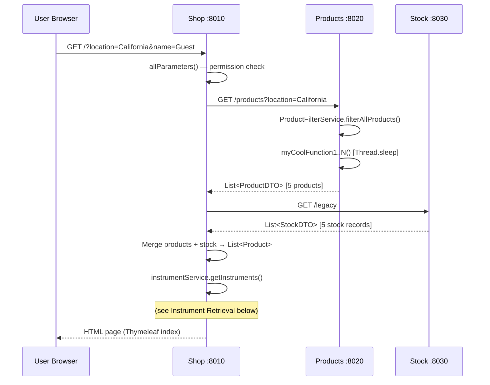
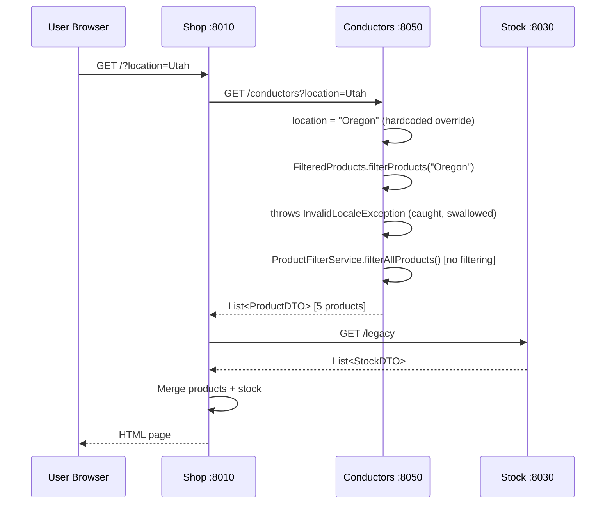
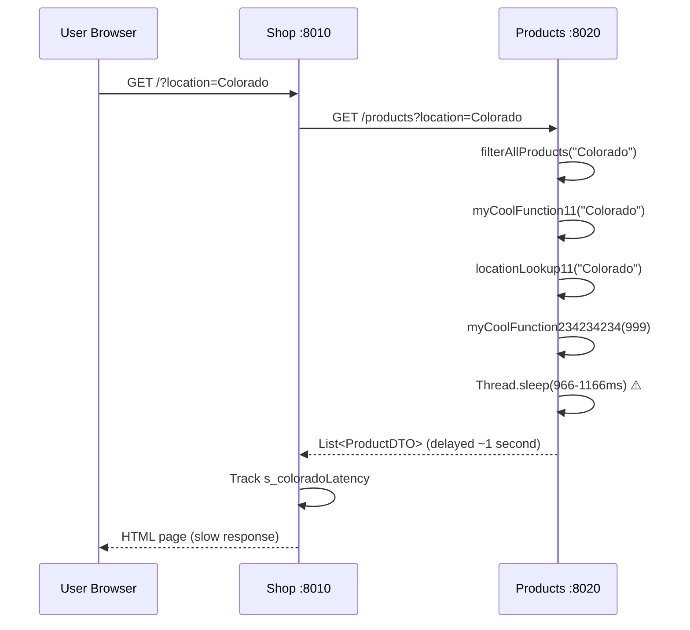
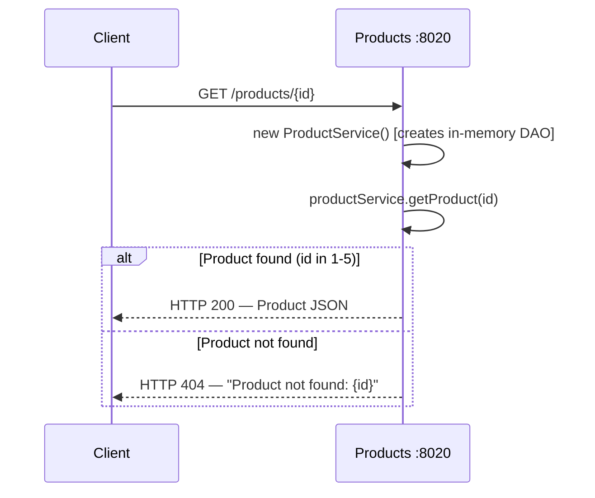
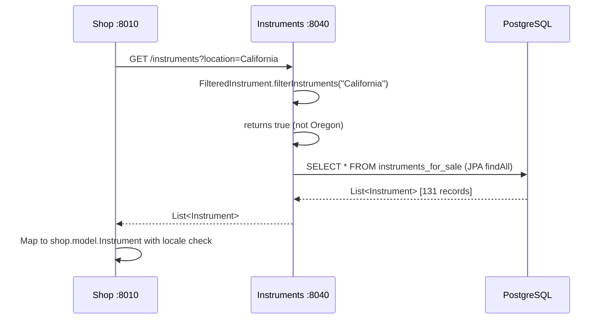
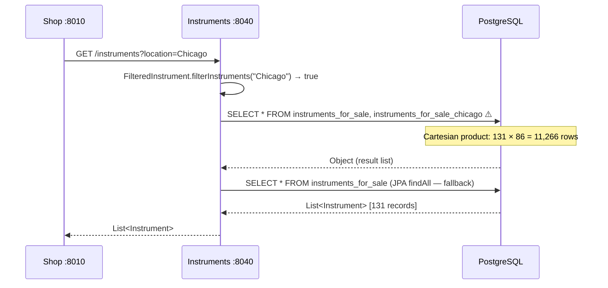

# Sequence Diagrams

## Product Retrieval Flow (Non-Utah Location)

## Product Retrieval Flow (Utah — via Conductors)

## Product Retrieval Flow (Colorado — with Latency Bug)

## Single Product Retrieval by ID (Products Service)

Note: This is a direct lookup flow with no downstream service calls, no filtering pipeline, and no intentional latency. The Products service handles the entire request internally using its in-memory HashMap.

## Instrument Retrieval Flow (Standard)

## Instrument Retrieval Flow (Chicago — with Cartesian Product)

## Related Documents

- [Component Diagrams](../structural/component-diagrams.md)
- [System Context](../architecture/system-context.md)
- [Behavior → Workflows](../../behavior/workflows.md)

---

[← Back to README](../../README.md)
