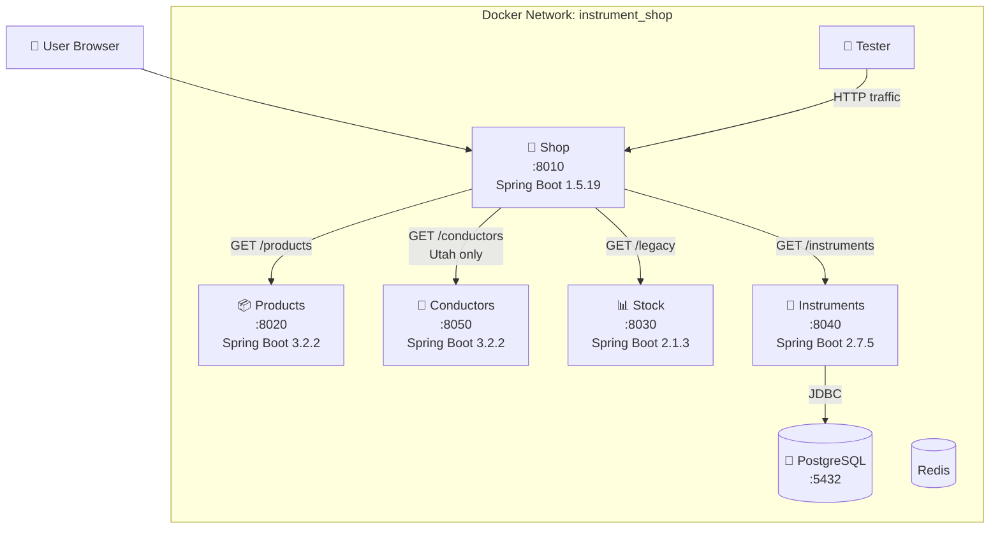
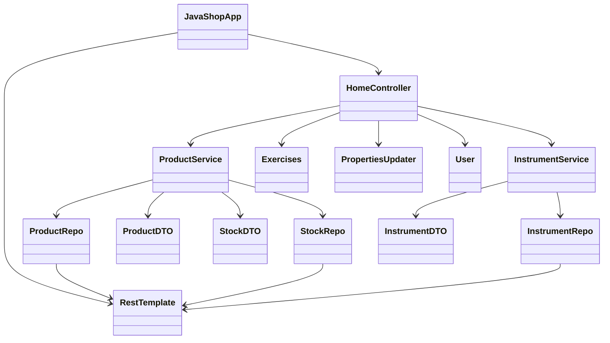

# Component Diagrams

## Service Relationship Diagram



## ASCII Component Diagram

```
┌──────────────────────────────────────────────────────────────┐
│                  Docker Network: instrument_shop              │
│                                                              │
│  ┌─────────┐    ┌──────────┐    ┌────────────┐              │
│  │  Redis   │    │  Tester  │───▶│    Shop    │              │
│  │ (cache)  │    │          │    │  :8010     │              │
│  └─────────┘    └──────────┘    │  SB 1.5.19 │              │
│                                  └──┬──┬──┬──┘              │
│                     ┌───────────────┘  │  │  └──────┐       │
│                     ▼                  ▼  │         ▼       │
│              ┌──────────┐    ┌────────┐│  │  ┌───────────┐  │
│              │ Products │    │ Stock  ││  │  │Instruments│  │
│              │  :8020   │    │ :8030  ││  │  │  :8040    │  │
│              │ SB 3.2.2 │    │SB 2.1.3││  │  │ SB 2.7.5 │  │
│              └──────────┘    │  [H2]  ││  │  └─────┬─────┘  │
│                              └────────┘│  │        │        │
│              ┌──────────┐              │  │        ▼        │
│              │Conductors│◀─────────────┘  │  ┌──────────┐   │
│              │  :8050   │  (Utah only)    │  │PostgreSQL│   │
│              │ SB 3.2.2 │                 │  │  :5432   │   │
│              └──────────┘                 │  └──────────┘   │
│                                           │                  │
│  ┌──────────┐                             │                  │
│  │Annotator │ (standalone CLI tool)       │                  │
│  │ Java 17  │                             │                  │
│  └──────────┘                             │                  │
└──────────────────────────────────────────────────────────────┘
```

## Class Dependency Diagram (Shop Module)



## Related Documents

- [Architecture → System Overview](../architecture/system-overview.md)
- [Sequence Diagrams](../diagrams/behavioral/sequence-diagrams.md)

---

[← Back to README](../../README.md)
